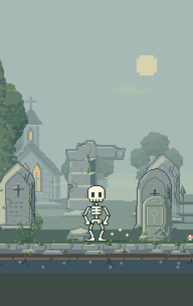
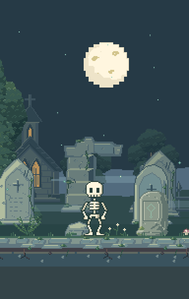
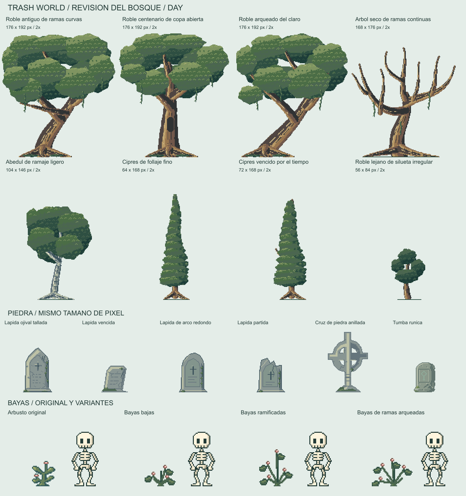
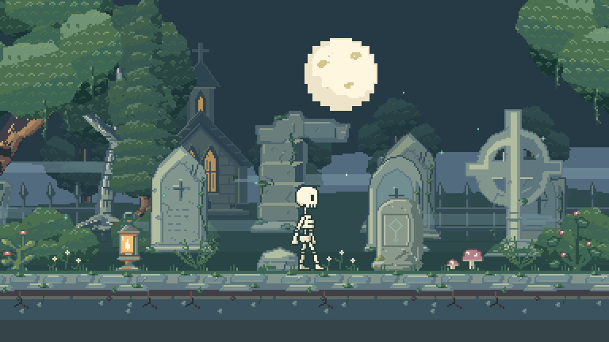

# Trash World

Un pequeno mundo de fantasia que cabe en tu telefono. Miga, una calaverita curiosa, explora, descubre, descansa y vuelve a armarse para seguir su aventura.

**Pixel art original | Vida autonoma | Bosque encantado | Guardado local**

[Empezar](#empezar) | [Visores](#visores) | [Assets](#biblioteca-de-assets) | [Documentacion](#documentacion)


*Render del bosque actual, generado con el renderer de produccion a 384 x 216 pixeles nativos y zoom entero 3. No es una captura de la interfaz del navegador.*

## Un Mundo Con Vida Propia

Trash World es un prototipo de mundo de bolsillo inspirado en los cubitos fisicos con personajes autonomos. La idea es observar a Miga viviendo a su ritmo, acompanarla e interactuar con su entorno, sin convertir cada momento en una orden.

- **Miga decide:** necesidades y personalidad influyen en explorar, investigar, comer y dormir.
- **Tiene memoria:** conserva descubrimientos y su vida se guarda en el navegador.
- **Responde al tacto:** tocar a Miga, mantener el toque o tocar el entorno produce distintas reacciones.
- **El bosque cambia:** dia, atardecer y noche; ruinas, niebla baja, luciernagas, viento suave y luz de vela en la capilla.
- **El cementerio tiene variedad:** arboles adultos de distintas siluetas, lapidas desgastadas y arbustos de bayas, con contornos propios de cada material.
- **Los huesitos tienen personalidad:** caminar de perfil, gestos, saludo y descanso en piezas que se reconstruyen al despertar.

Canvas 2D, JavaScript y Vite. Sin backend, cuentas, analitica ni servicios remotos para jugar.

## Galeria

### Dia Y Noche En Formato Movil

<p align="center">
  
  
</p>

*Renders de la escena a 192 x 304 pixeles nativos y zoom entero 2. Muestran el encuadre vertical; la revision actual de CSS y controles en navegador sigue pendiente.*

### Biblioteca A Escala Comun



*Lamina de las fuentes editables. Arboles y piedra a zoom entero 2; bayas y Miga a zoom entero 3. Cada familia mantiene su escala, lienzo y ancla.*

### Ultima Pasada: Bosque Refinado

- Diez dibujos refinados: robles con estructuras propias, abedul, cipreses, arbol seco, roble lejano, matorral y capilla.
- Ramas curvas de grosor decreciente, integradas detras del follaje; corteza y hojas tienen sombras y luces propias de su material.
- Lapidas redonda y partida, tres arbustos decorativos de bayas y los tiles de suelo siguen disponibles como assets reutilizables.
- Seis arboles con transiciones suaves entre tonos de pequenos grupos de hojas; siluetas, troncos y raices permanecen fijos.
- Capilla redibujada con ventanas alineadas y cristal calido permanente, sin frames de encendido/apagado.
- Camara mas reactiva y proyeccion de parallax coherente con el sendero y los objetos.
- Refinamiento del farol, ruinas, suelo y vegetacion, sin cambiar el diseno ni los clips aprobados de Miga.
- Retiro del arbolito pequeno del suelo: su fuente se conserva en el laboratorio y los guardados antiguos mantienen sus recuerdos.

Los detalles de la biblioteca anterior estan en [Variantes y animacion ambiental](docs/LIVING_CEMETERY.md).

La [revision visual del bosque](docs/PREMIUM_FOREST.md) detalla la pasada de forma, material y movimiento del 2026-10-08, preparada para versionar como `v0.1.4`. El commit, la etiqueta y el push se realizan por separado; la entrega local no equivale a una publicacion en GitHub.

### Movimiento Del Entorno



*Muestra animada del renderer de produccion, con un recorrido controlado para revisar camara, parallax y ambiente. No es una captura de navegador ni una medicion de rendimiento del juego autonomo.*

## Empezar

Requisito: **Node.js 22.12 o posterior**, con npm.

```bash
git clone https://github.com/bryanpineda-dev/trash-world.git
cd trash-world
npm ci
npm run dev
```

Abre la URL que muestre Vite, normalmente `http://127.0.0.1:5173`. Si el puerto esta ocupado, la terminal indica otro disponible.

Para compilar y revisar la version de produccion:

```bash
npm run build
npm run preview
```

`dist/` contiene la aplicacion estatica lista para servir. `node_modules/` y `dist/` no se versionan.

## Visores

Las tres vistas estan disponibles en desarrollo y en el build, bajo el mismo origen:

| Ruta | Vista | Uso |
| --- | --- | --- |
| `/` | Mundo vivo | Observar e interactuar con la vida autonoma de Miga. |
| `/asset-lab.html` | Personaje y objetos | Revisar piezas, clips, direccion y objetos animados. |
| `/biome-lab.html` | Composicion del bosque | Comparar luz, posicion, poses y familias de assets. |

El visor del bioma comparte el renderer del juego, pero no lee ni escribe su partida. La biblioteca se abre desde el boton de cuadricula y mantiene a Miga como referencia de escala.

## Biblioteca De Assets

La biblioteca distingue el kit del personaje de la escenografia. Todos usan el mismo pixel nativo: un arbol adulto tiene un dibujo mayor, no una ampliacion individual de un sprite pequeno. Los bordes del entorno usan tonos propios del material.

| Kit | Fuentes | Paleta | Exportacion |
| --- | --- | --- | --- |
| Miga y objetos | 5 piezas, 7 slots, 10 clips; 3 objetos activos y 1 archivado | 16 colores | Atlas de 109 frames, personaje y laminas comparativas. |
| Bosque y cementerio | 28 assets en 8 familias | 32 tonos independientes | Atlas de 414 frames y 138 PNG transparentes, con viento y luz continua de vela. |

```text
assets/
  source/
    parts.json                 # Miga, tres objetos activos y el roble archivado
    characters.json            # Rigs, anclas y secuencias de objetos
    animations.json            # Poses y clips compartidos
    style.json                 # Paleta y contrato del personaje
    biome.json                 # Indice del entorno, paletas y capas
    environment/
      trees/
      vegetation/              # Helechos, hongos, flores y matorrales
        berries/               # Variantes decorativas de bayas
      gravestones/
      ruins/
      fences/
      terrain/
      sky/
      architecture/churches/
  generated/
    atlas.png / atlas.json     # Kit animado
    biome.png / biome.json     # Escenografia compartida
    environment/               # PNG individuales por familia, asset y fase
```

Los JSON son las fuentes editables. Los PNG y sus metadatos se generan de forma determinista y se incluyen en Git junto a ellas.

El suelo usa tres tiles reutilizables con uniones compatibles. Hongos, flores, helechos, bayas, arboles y lapidas tambien son assets independientes, no partes de una imagen de fondo aplanada. Cada exportacion vive en `assets/generated/environment/<familia>/<asset>/`: `day.png`, `evening.png` y `night.png`, mas archivos `<fase>-<variante>.png` cuando hay animacion. Las subfamilias, como `vegetation/berries/`, conservan sus carpetas.

Despues de modificar un dibujo, pose o paleta:

```bash
npm run assets
npm run check
```

Las pruebas comparan cada pixel exportado con su fuente; detectan atlas desactualizados, anclas incorrectas y cambios en las animaciones aprobadas. Para agregar assets, consulta el [flujo de trabajo](docs/ASSET_WORKFLOW.md) y el [contrato del bioma](docs/BIOME.md).

## Verificacion

**Ultima verificacion local: 102 pruebas aprobadas y build correcto.**

```bash
npm run assets:check  # Validar fuentes del personaje y del bioma
npm test             # Simulacion, assets, persistencia y cache offline
npm run check        # Tests y build de las tres vistas
```

La cobertura incluye identidad de Miga, animaciones, siluetas conectadas, escala, uniones del terreno, paletas por profundidad, rutas de la biblioteca, toques, autonomia, guardados y progreso offline. Tambien comprueba cada variante ambiental y la carga de partidas dirigidas al arbol retirado.

La galeria actual se reviso con renders fuera del navegador en dia y noche, con lienzos de escritorio y movil. Las pruebas de pixeles confirman que el ambiente cambia al avanzar el reloj y se congela al desactivar el movimiento.

**Pendiente:** repetir la revision de interfaz, controles y encuadre CSS en navegador con esta pasada. La herramienta de navegador no respondio; los renders no sustituyen esa comprobacion. Tampoco se han validado un Android fisico ni el funcionamiento prolongado en el hardware de destino. El historial y alcance de cada pasada estan en [Verificacion](docs/VERIFICATION.md).

## Guardado Y Modo Offline

- La partida se guarda cada cinco segundos, al interactuar y al ocultar la app, bajo `localStorage["trash-world.save"]`.
- Los datos incluyen necesidades, personalidad, posicion, descanso y descubrimientos. Los guardados danados se respaldan antes de reemplazarlos; versiones futuras se protegen contra sobrescritura.
- Al volver se resume un maximo de ocho horas de necesidades, descanso y reloj. No se reproducen todos los fotogramas ni se inventan descubrimientos.
- Si el almacenamiento falla, la escena sigue funcionando y avisa que no esta guardando. El reinicio del panel requiere confirmacion y borra la vida de ese origen.
- El cache de la PWA se genera con el build y el service worker se registra solo en produccion. Requiere HTTPS o localhost y una primera carga completa con conexion.

**Cada origen tiene su propia vida:** cambiar el puerto, dominio, navegador o perfil no transporta la partida anterior.

<details>
<summary>Probar la escena desde Android en la misma red</summary>

```bash
npm run dev -- --host 0.0.0.0
```

Abre `http://IP-DE-LA-PC:PUERTO` en el telefono, usando la IP local de la PC y el puerto que indique Vite. Windows puede solicitar acceso a la red local.

HTTP en una IP local permite revisar la escena, pero no ofrece instalacion PWA ni cache offline. Para una prueba completa, sirve `dist/` desde HTTPS o usa un tunel localhost con depuracion USB. En un Android antiguo, prueba el build de produccion, no solo el servidor de desarrollo.

</details>

## Estado Y Roadmap

Trash World sigue en desarrollo. La base de vida autonoma y el personaje estan construidos; el primer bioma permite afinar la identidad visual y ampliar la biblioteca.

| Etapa | Enfoque | Estado |
| --- | --- | --- |
| V0.1 - The Creature | Miga, autonomia, interaccion, guardados y PWA | Base implementada; refinamiento visual en curso. |
| V0.2 - The Phone | Inclinacion, sacudidas, rotacion, calibracion y vibracion | Pendiente; el adaptador actual entrega valores neutros. |
| V0.3 - The World | Eventos, mas objetos, audio y pruebas prolongadas | Planeado. |
| V1.0 - The Toy | Estabilidad, instalacion y posible APK o carcasa fisica | Planeado. |

La conexion entre dispositivos queda para una etapa independiente. No se presenta como funcionalidad disponible.

## Documentacion

- [Arquitectura](docs/ARCHITECTURE.md)
- [Personaje: Miga](docs/CHARACTER.md)
- [Guia de estilo](docs/ASSET_STYLE.md)
- [Patrones de materiales](docs/MATERIAL_STYLE.md)
- [Flujo de trabajo de assets](docs/ASSET_WORKFLOW.md)
- [Objetos y escala](docs/ENVIRONMENT.md)
- [Bosque y biblioteca](docs/BIOME.md)
- [Variantes y animacion ambiental](docs/LIVING_CEMETERY.md)
- [Forma, material y movimiento del bosque](docs/PREMIUM_FOREST.md)
- [Verificacion](docs/VERIFICATION.md)
- [Roadmap](docs/ROADMAP.md)

Proyecto de [bryanpineda-dev](https://github.com/bryanpineda-dev).
