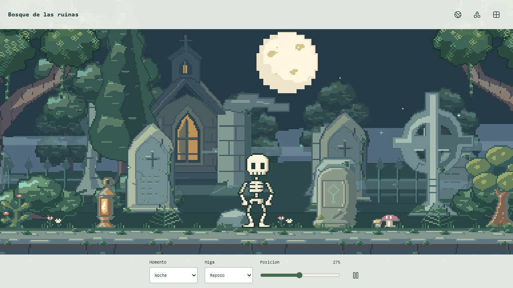
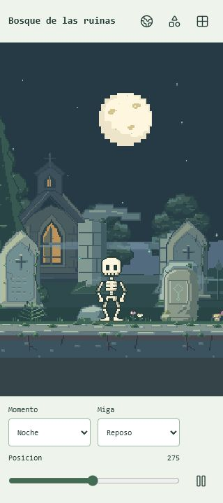
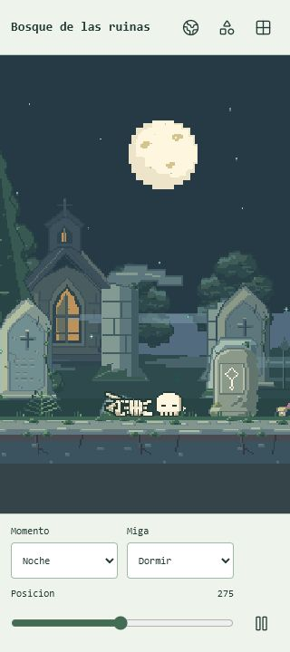
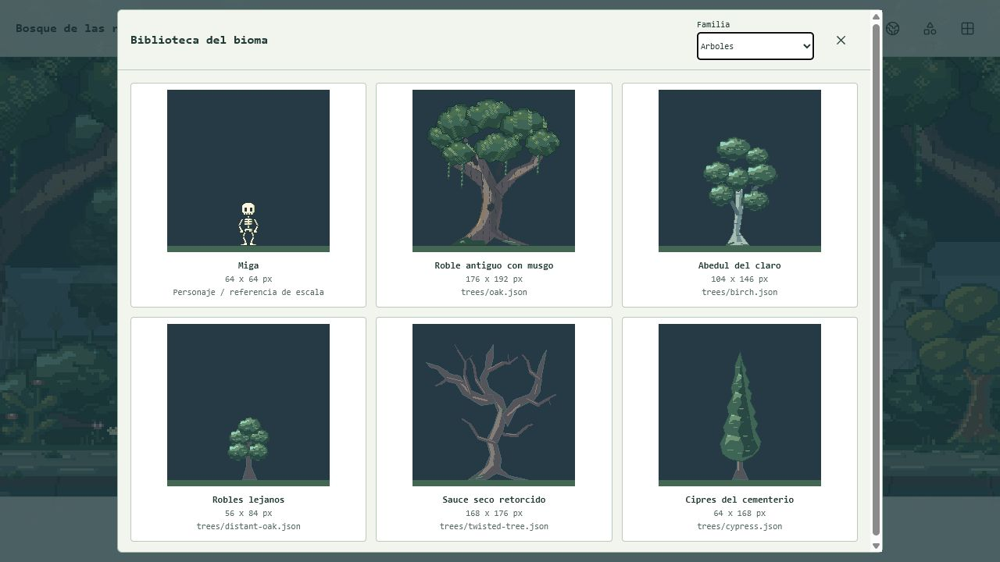

# Trash World

Un pequeno mundo de fantasia que cabe en tu telefono. Miga, una calaverita curiosa, explora, descubre, descansa y vuelve a armarse para seguir su aventura.

**Pixel art original | Vida autonoma | Bosque encantado | Guardado local**

[Empezar](#empezar) | [Visores](#visores) | [Assets](#biblioteca-de-assets) | [Documentacion](#documentacion)



*Captura real del visor del bioma, con la misma escenografia que utiliza el mundo autonomo.*

## Un Mundo Con Vida Propia

Trash World es un prototipo de mundo de bolsillo inspirado en los cubitos fisicos con personajes autonomos. La idea es observar a Miga viviendo a su ritmo, acompanarla e interactuar con su entorno, sin convertir cada momento en una orden.

- **Miga decide:** necesidades y personalidad influyen en explorar, investigar, comer y dormir.
- **Tiene memoria:** conserva descubrimientos y su vida se guarda en el navegador.
- **Responde al tacto:** tocar a Miga, mantener el toque o tocar el entorno produce distintas reacciones.
- **El bosque cambia:** dia, atardecer y noche; ruinas, niebla baja, luciernagas y ventanas calidas.
- **Los huesitos tienen personalidad:** caminar de perfil, gestos, saludo y descanso en piezas que se reconstruyen al despertar.

Canvas 2D, JavaScript y Vite. Sin backend, cuentas, analitica ni servicios remotos para jugar.

## Galeria

### Miga En Movil

<p align="center">
  
  
</p>

*Reposo y descanso en el visor de 320 x 720. Los controles dejan visible el suelo y no cubren al personaje.*

### Biblioteca A Escala Comun



*Fuentes completas a escala nativa, filtradas por familia. Cada asset conserva su lienzo, ancla y archivo de origen.*

## Empezar

Requisito: **Node.js 22.12 o posterior**, con npm.

```bash
git clone https://github.com/bryanpineda-dev/trash-world.git
cd trash-world
npm ci
npm run dev
```

Abre la URL que muestre Vite, normalmente `http://127.0.0.1:5173`. Si el puerto esta ocupado, la terminal indica otro disponible.

Para compilar y revisar la version de produccion:

```bash
npm run build
npm run preview
```

`dist/` contiene la aplicacion estatica lista para servir. `node_modules/` y `dist/` no se versionan.

## Visores

Las tres vistas estan disponibles en desarrollo y en el build, bajo el mismo origen:

| Ruta | Vista | Uso |
| --- | --- | --- |
| `/` | Mundo vivo | Observar e interactuar con la vida autonoma de Miga. |
| `/asset-lab.html` | Personaje y objetos | Revisar piezas, clips, direccion y objetos animados. |
| `/biome-lab.html` | Composicion del bosque | Comparar luz, posicion, poses y familias de assets. |

El visor del bioma comparte el renderer del juego, pero no lee ni escribe su partida. La biblioteca se abre desde el boton de cuadricula y mantiene a Miga como referencia de escala.

## Biblioteca De Assets

La biblioteca distingue el kit del personaje de la escenografia. Todos usan el mismo pixel nativo: un arbol adulto tiene un dibujo mayor, no una ampliacion individual de un sprite pequeno. Los bordes del entorno usan tonos propios del material.

| Kit | Fuentes | Paleta | Exportacion |
| --- | --- | --- | --- |
| Miga y objetos | 5 piezas, 7 slots, 10 clips y 4 objetos animados | 16 colores | Atlas de 109 frames, personaje y laminas comparativas. |
| Bosque y cementerio | 20 assets en 8 familias | 32 tonos independientes | Atlas de 180 variantes y 60 PNG transparentes individuales. |

```text
assets/
  source/
    parts.json                 # Miga y los cuatro objetos interactivos
    characters.json            # Rigs, anclas y secuencias de objetos
    animations.json            # Poses y clips compartidos
    style.json                 # Paleta y contrato del personaje
    biome.json                 # Indice del entorno, paletas y capas
    environment/
      trees/
      vegetation/
      gravestones/
      ruins/
      fences/
      terrain/
      sky/
      architecture/churches/
  generated/
    atlas.png / atlas.json     # Kit animado
    biome.png / biome.json     # Escenografia compartida
    environment/               # PNG individuales por familia y fase
```

Los JSON son las fuentes editables. Los PNG y sus metadatos se generan de forma determinista y se incluyen en Git junto a ellas.

Despues de modificar un dibujo, pose o paleta:

```bash
npm run assets
npm run check
```

Las pruebas comparan cada pixel exportado con su fuente; detectan atlas desactualizados, anclas incorrectas y cambios en las animaciones aprobadas. Para agregar assets, consulta el [flujo de trabajo](docs/ASSET_WORKFLOW.md) y el [contrato del bioma](docs/BIOME.md).

## Verificacion

**Ultima verificacion local: 88 pruebas aprobadas y build correcto.**

```bash
npm run assets:check  # Validar fuentes del personaje y del bioma
npm test             # Simulacion, assets, persistencia y cache offline
npm run check        # Tests y build de las tres vistas
```

La cobertura incluye identidad de Miga, animaciones, siluetas conectadas, escala, uniones del terreno, paletas por profundidad, rutas de la biblioteca, toques, autonomia, guardados y progreso offline.

Las capturas se revisaron en escritorio y movil. No se ha validado todavia un telefono Android fisico ni el funcionamiento prolongado en el hardware de destino. El detalle de cada pasada esta en [Verificacion](docs/VERIFICATION.md).

## Guardado Y Modo Offline

- La partida se guarda cada cinco segundos, al interactuar y al ocultar la app, bajo `localStorage["trash-world.save"]`.
- Los datos incluyen necesidades, personalidad, posicion, descanso y descubrimientos. Los guardados danados se respaldan antes de reemplazarlos; versiones futuras se protegen contra sobrescritura.
- Al volver se resume un maximo de ocho horas de necesidades, descanso y reloj. No se reproducen todos los fotogramas ni se inventan descubrimientos.
- Si el almacenamiento falla, la escena sigue funcionando y avisa que no esta guardando. El reinicio del panel requiere confirmacion y borra la vida de ese origen.
- El cache de la PWA se genera con el build y el service worker se registra solo en produccion. Requiere HTTPS o localhost y una primera carga completa con conexion.

**Cada origen tiene su propia vida:** cambiar el puerto, dominio, navegador o perfil no transporta la partida anterior.

<details>
<summary>Probar la escena desde Android en la misma red</summary>

```bash
npm run dev -- --host 0.0.0.0
```

Abre `http://IP-DE-LA-PC:PUERTO` en el telefono, usando la IP local de la PC y el puerto que indique Vite. Windows puede solicitar acceso a la red local.

HTTP en una IP local permite revisar la escena, pero no ofrece instalacion PWA ni cache offline. Para una prueba completa, sirve `dist/` desde HTTPS o usa un tunel localhost con depuracion USB. En un Android antiguo, prueba el build de produccion, no solo el servidor de desarrollo.

</details>

## Estado Y Roadmap

Trash World sigue en desarrollo. La base de vida autonoma y el personaje estan construidos; el primer bioma permite afinar la identidad visual y ampliar la biblioteca.

| Etapa | Enfoque | Estado |
| --- | --- | --- |
| V0.1 - The Creature | Miga, autonomia, interaccion, guardados y PWA | Base implementada; refinamiento visual en curso. |
| V0.2 - The Phone | Inclinacion, sacudidas, rotacion, calibracion y vibracion | Pendiente; el adaptador actual entrega valores neutros. |
| V0.3 - The World | Eventos, mas objetos, audio y pruebas prolongadas | Planeado. |
| V1.0 - The Toy | Estabilidad, instalacion y posible APK o carcasa fisica | Planeado. |

La conexion entre dispositivos queda para una etapa independiente. No se presenta como funcionalidad disponible.

## Documentacion

- [Arquitectura](docs/ARCHITECTURE.md)
- [Personaje: Miga](docs/CHARACTER.md)
- [Guia de estilo](docs/ASSET_STYLE.md)
- [Flujo de trabajo de assets](docs/ASSET_WORKFLOW.md)
- [Objetos y escala](docs/ENVIRONMENT.md)
- [Bosque y biblioteca](docs/BIOME.md)
- [Verificacion](docs/VERIFICATION.md)
- [Roadmap](docs/ROADMAP.md)

Proyecto de [bryanpineda-dev](https://github.com/bryanpineda-dev).
